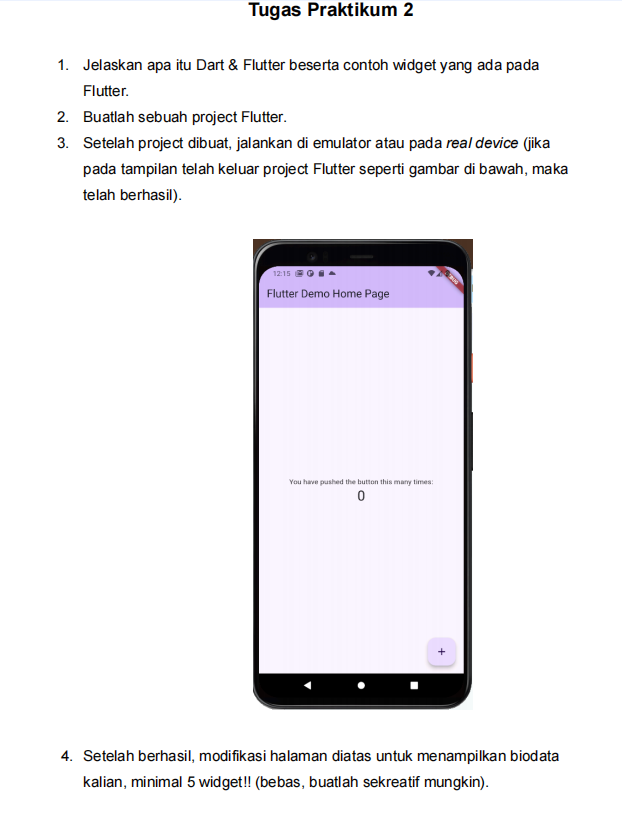
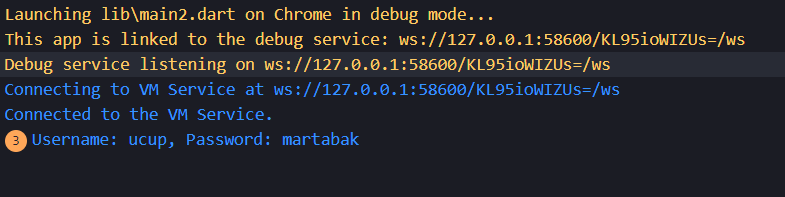
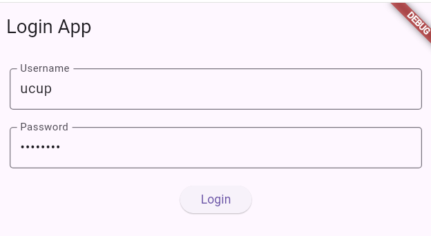

# PPB_ABDUL RONI_2211104080_SE-06-C/01_Running-Modul/LP_01

<li> Nama   : Abdul Roni
<li> NIM    : 2211104080
<li> Kelas  : SE-06-02

## TUGAS PRAKTIKUM

## jawaban nomor 1 
<li> Dart dalam dunia pemrograman, bisa diibaratkan sebagai salah satu bahan bangunan yang sangat bagus. Ia adalah sebuah bahasa pemrograman yang digunakan untuk membangun aplikasi. Dart dirancang khusus agar mudah dipelajari dan digunakan, serta sangat efisien.Bayangkan membangun sebuah rumah. Anda bisa menggunakan berbagai macam bahan bangunan, seperti kayu, batu bata, atau beton. Setiap bahan memiliki kelebihan dan kekurangannya masing-masing

<li>Flutter adalah seperti sebuah perangkat lunak yang sangat pintar. Ia membantu kita merancang dan membangun rumah (aplikasi) dengan cepat dan mudah. Menggunakan Flutter, kita bisa membuat desain rumah yang indah dan fungsional, lalu membangunnya di atas berbagai jenis tanah (platform seperti iOS, Android, web, dan desktop). Hebatnya lagi, Flutter menggunakan bahan-bahan bangunan (komponen) yang sudah jadi dan berkualitas tinggi, sehingga rumah yang kita bangun akan sangat kuat dan tahan lama.

<li>Jadi, apa hubungan antara Dart dan Flutter?

    Dart adalah bahan bakunya, sedangkan Flutter adalah alat dan desainnya.
    Dart memberikan kita kemampuan untuk menulis kode-kode yang akan menjalankan aplikasi kita.
    Flutter menggunakan kode-kode Dart ini untuk menciptakan tampilan yang menarik dan interaktif pada      aplikasi kita.

<li>Widget Dasar:

    Text: Digunakan untuk menampilkan teks pada layar.
    Container: Merupakan wadah untuk mengatur tata letak dan tampilan widget lainnya.
    Row: Menampilkan widget-widget secara horizontal (berbaris).
    Column: Menampilkan widget-widget secara vertikal (berkolom).
    Image: Menampilkan gambar.
    Icon: Menampilkan ikon.
    ElevatedButton: Tombol dengan tampilan 3D.
    TextButton: Tombol dengan tampilan datar.

Widget Tata Letak:

    Padding: Memberikan jarak antara widget dengan elemen lainnya.
    Center: Menempatkan widget di tengah layar atau wadah.
    SizedBox: Membuat ruang kosong dengan ukuran tertentu.
    Expanded: Membuat widget mengisi seluruh ruang yang tersedia.

Widget Form:

    TextField: Input teks.
    TextFormField: Input teks yang lebih kompleks, sering digunakan dalam form.
    Checkbox: Kotak centang.
    Radio: Tombol radio.
    DropdownButton: Menu dropdown untuk memilih opsi.

Widget Navigasi:

    Navigator: Mengelola navigasi antar halaman.
    MaterialPageRoute: Membuat rute untuk navigasi.

## jawaban nomor 2
<li> membuat fitur flutter login

<li>import 'package:flutter/material.dart';
void main() {
  runApp(MyApp());
}
class MyApp extends StatelessWidget {
  @override
  Widget build(BuildContext context) {
    return MaterialApp(
      title: 'Login App',
      theme: ThemeData(
        primarySwatch: Colors.blue,
      ),
      home: LoginPage(),
    );
  }
}
class LoginPage extends StatefulWidget {
  @override
  _LoginPageState createState() => _LoginPageState();
}
class _LoginPageState extends State<LoginPage> {
  final _formKey = GlobalKey<FormState>();
  String _username = '';
  String _password = '';

  @override
  Widget build(BuildContext context) {
    return Scaffold(
      appBar: AppBar(
        title: Text('Login App'),
      ),
      body: Padding(
        padding: const EdgeInsets.all(20.0),
        child: Form(
          key: _formKey,
          child: Column(
            children: [
              TextFormField(
                decoration: InputDecoration(
                  labelText: 'Username',
                  border: OutlineInputBorder(),
                ),
                validator: (value) {
                  if (value!.isEmpty) {
                    return 'Username tidak boleh kosong';
                  }
                  return null;
                },
                onSaved: (value) => _username = value!,
              ),
              SizedBox(height: 20),
              TextFormField(
                obscureText: true,
                decoration: InputDecoration(
                  labelText: 'Password',
                  border: OutlineInputBorder(),
                ),
                validator: (value) {
                  if (value!.isEmpty) {
                    return 'Password tidak boleh kosong';
                  }
                  return null;
                },
                onSaved: (value) => _password = value!,
              ),
              SizedBox(height: 20),
              ElevatedButton(
                onPressed: () {
                  if (_formKey.currentState!.validate()) {
                    _formKey.currentState!.save();
                    // Proses login di sini
                    print('Username: $_username, Password: $_password');
                  }
                },
                child: Text('Login'),
              ),
            ],
          ),
        ),
      ),
    );
  }
}
</li>

## Git Terinstall
<li> Screenshot bukti terinstall git melalui cmd

## Installasi Extensions pada visual studio code
<li> Screenshot visual studio code dan extensions "Dart" juga "Flutter"

 

